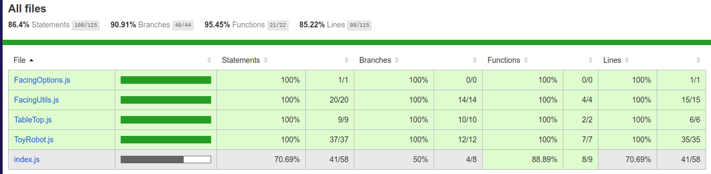

<div align="center">
  
  <h1>Toy Robot Simulator</h1>
  <p align="center">Simulation of a toy robot moving on a square tabletop</p>
</div>

<h2 align="center">Requirements</h2>
<div align="center">
&bull; Mac OS X, Windows, or Linux<br/>
&bull; <a href="https://nodejs.org/">Node.js</a> v8.12 or newer<br/>
&bull; <a href="https://www.npmjs.com/">NPM v6.4</a> or newer<br/>
</div>

<h2 align="center">Install Dependencies</h2>

```bash
npm install
```

<h2 align="center">Execute App</h2>  

```bash
npm run start
```

<h2 align="center">Execute Tests</h2>  

```bash
npm run test
```

<h2 align="center">Generate Coverage Report</h2>  

```bash
npm run coverage
```



<h2 align="center">Execute Eslint</h2>  

```bash
npm run lint
```